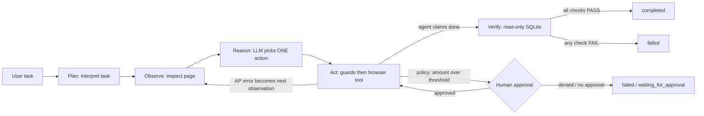

# invoiceop-ai-worker

A narrow but real autonomous AI worker for accounts-payable invoice processing.

> "Process the latest invoice from Acme Corp." -> the worker browses a simulated company intranet, picks the right
> invoice from what it *observes*, extracts it, enters it into an internal AP system, recovers from an injected AP
> validation error, asks a human before submitting high-value invoices, and only reports success after
> **independently checking the database**.

This is a prototype against a local mock environment. It is not production-ready (see Known limitations).

## Business problem

AP staff repeat the same loop: find the vendor's invoice, work out which one is latest, read it, key vendor / amount /
dates into the AP system, fix validation errors, submit, check it landed, and escalate risky ones. This worker
automates the low-risk part and keeps a human in control of the high-risk part.

## Why this is an agent, not a chatbot or a script

- **Not a chatbot:** it operates software (a real Chromium browser) and changes state (SQLite AP records).
- **Not a hardcoded workflow:** no code path knows a vendor, URL-per-vendor, or the order of steps. Each turn the LLM sees
  the current page and chooses one action. Acme and Globex differ only in data (a test scans `agent/` and `tools/`
  to enforce "no vendor-specific code").
- **Not trust-the-LLM:** the LLM proposes; deterministic code decides what is allowed and whether it happened.

## Architecture



State machine in `agent/graph.py` (~30 lines, LangGraph-style, no LangGraph dependency). One reasoning agent, no
multi-agent layer.

| Layer | Owns | File |
| --- | --- | --- |
| LLM | interpret task, choose next action, read errors, justify with short evidence | `agent/nodes.py`, `agent/prompts.py` |
| Guards | action must be on observed data, vendor must match, extracted values must appear on the page, form values must equal extraction, intranet-only navigation, bounded steps/repeats/failures | `agent/nodes.py` |
| Policy | amount > `APPROVAL_THRESHOLD` -> human approval, inside `submit` before the browser submits | `tools/policy.py` |
| Verifier | `completed` is set only here: SQLite checks + agreement with the source portal record | `tools/verification.py` |
| Browser | navigate, inspect_page, click, fill, submit (Playwright) | `tools/browser.py` |

## The loop and its tools

Observe -> Reason -> Act -> Observe -> Verify, with recovery happening through observation. Actions the LLM can choose:
`navigate`, `click`, `select_invoice`, `extract_invoice`, `fill_form`, `submit`, `finish`.
Every decision carries short evidence (dates, ids, messages seen). The trace records decisions, actions, observations,
errors and evidence, never chain-of-thought.

## Mock environment

`mock_app/` (Flask + SQLite): `/inbox` (vendor invoice portal, 6 invoices across Acme / Globex / Initech, deliberately
unordered), `/invoice/<id>`, `/ap` (internal AP records), `/ap/create` (form). Two separate tables model two systems:
`inbox_invoices` (read) and `invoices` (written). Optional fault injection: `invoice_date_once`, `invoice_date_always`,
`store_wrong_amount`.

## Failure recovery

AP rejects the first submission with "Invoice date is required." (and drops the field). The error returns as the next
observation; the agent fixes only what the error points to via `fill_form`, then resubmits. Bounds: at most
`MAX_RETRIES` AP rejections; resubmitting without changing anything is blocked; step budget, repeat detector,
consecutive-failure limit, and a schema-retry cap for malformed LLM output.

## Human approval

Deterministic: amount strictly above `APPROVAL_THRESHOLD` (default 200000) pauses before submit with a CLI prompt
(`Approve? [y/n]`; EOF counts as deny). The LLM cannot decide the threshold or skip it: clicking the form button directly
is rejected. No approver -> `waiting_for_approval`, nothing written. Denied -> `failed`, nothing written.

## Independent verification

After the agent says "done", `tools/verification.py` opens SQLite read-only and checks: database_readable, invoice_exists,
vendor / amount / invoice_date / due_date matches, status_confirmed, matches_source_record (portal table), and
approval_respected. The `store_wrong_amount` fault makes the UI say "created" while storing 125001: the run ends
`failed`, not `completed`.

Final statuses: `completed`, `failed`, `waiting_for_approval`, `needs_clarification`. CLI exit codes 0 / 2 / 3.

## Setup (Windows, PowerShell, Python 3.14)

```powershell
python --version                  # expect 3.14
python -m venv .venv
.venv\Scripts\Activate.ps1        # if blocked: Set-ExecutionPolicy -Scope Process Bypass
pip install -r requirements.txt
playwright install chromium       # one-time, ~150 MB
copy .env.example .env            # put your key in GROQ_API_KEY (never commit .env)
```

macOS/Linux: `source .venv/bin/activate`. Pydantic and LangGraph are intentionally not used (see Decisions).

## Environment variables

| Variable | Purpose |
| --- | --- |
| `GROQ_API_KEY` | required for `run.py agent` and `--mode live` evals |
| `LLM_MODEL` | default `openai/gpt-oss-20b` |
| `LLM_REASONING_EFFORT` | `low` (default) / `medium` / `high` |
| `LLM_BASE_URL` | override the OpenAI-compatible endpoint |
| `APPROVAL_THRESHOLD` | default `200000` |
| `MAX_RETRIES` | default `3` |
| `MOCK_APP_URL`, `INVOICEOP_DB`, `INVOICEOP_HEADLESS`, `INVOICEOP_CHROMIUM_PATH` | environment / browser overrides |
| `INVOICEOP_FAULT` | set by `serve --fault X` |

## Demo (2-3 minutes)

Terminal 1: `python run.py serve --reset --fault invoice_date_once`
Terminal 2: `python run.py agent "Process the latest invoice from Acme Corp." --headed`

Talk track, in the order the trace shows it:
1. Natural-language task, `[PLAN]` line. 2. `[OBSERVE]` invoice list (3 Acme invoices). 3. `[DECISION]` + `[EVIDENCE]`:
selects AC-2026-104 because 2026-10-02 is the newest Acme date. 4. Opens it and `[EXTRACT]` (grounded against the page).
5. Browser fills the AP form. 6. `[RECOVERY]` AP rejects "Invoice date is required."; agent refills only that field.
7. Retry succeeds. 8. `[VERIFY]` one PASS line per database check. 9. `[RESULT] completed`.

Then the two safety beats (30 s each): `serve --reset` + Initech task (`[POLICY]` + `Approve? [y/n]`), and
`serve --reset --fault store_wrong_amount` + Acme task (UI says created, verifier says `amount_matches=FAIL`, status `failed`).
Reset the DB between runs; AP rejects duplicates by design.

## Evaluation

```powershell
python -m evals.run_eval --mode live      # real model: the numbers that matter
python -m evals.run_eval --mode double    # deterministic LLM double: infrastructure check only
pytest -q                                 # or: python -m unittest tests.test_agent
```

Ten scenarios, each with its own server, temp DB and real Chromium: latest Acme, latest Globex, submission failure ->
recovery, high-value approved / denied / no approver, unknown vendor, ambiguous task, AP never accepts (bounded retries),
UI lies about amount (verifier catches it). Metrics are computed from the agent's returned results, not typed in; per-scenario
rows are written to `evals/results_<mode>.json`.

Metric definitions: `task_success_rate` = scenarios whose final status equals the expected status (including expected
controlled failures); `recovery_success_rate` = injected-AP-error runs that ended `completed`; `verification_success_rate` =
runs that reached the verifier whose checks all passed; `false_completions` = `completed` while a check failed (must be 0).

**Deterministic double run (infrastructure check, NOT model quality):**
10/10 scenarios matched expected status, recovery 1/1, 0 false completions, 3 human escalations, 16.0 average browser
actions and 8.1 average LLM calls per scenario. These LLM-call counts are the double's, not a model's.
The double reads the same prompt and observations as the real model and follows a generic policy; it proves the loop,
guards, policy and verifier, nothing else.

**Live model results:** run `python -m evals.run_eval --mode live` and record them here. They have not been produced in this
repository's build sandbox (no network). Earlier manual live runs (Groq `gpt-oss-20b`, Windows, Python 3.14) of the
recovery, approval and UI-lies scenarios behaved as designed; those were single runs, not a measured rate.

## Mapping to the evaluation criteria

| Criterion | Where it shows |
| --- | --- |
| Autonomy | LLM picks the invoice from observed dates and chooses every next action; no per-vendor or per-step script |
| Execution | real Chromium via Playwright; AP records actually written to SQLite |
| Reliability | observation-based recovery, bounded retries, step/repeat/failure limits, malformed-output retries |
| Verification | independent read-only DB verifier; only it can set `completed`; catches UI-says-success-but-wrong-data |
| Generalization | same agent for Acme / Globex / Initech by changing data; test enforces no vendor-specific code |
| Engineering quality | typed state, small modules, 49 end-to-end tests, mutation-checked guards, eval harness |
| Product thinking | automates the low-risk portion, human approval on money over threshold, honest four-way status |
| Technical understanding | clear split: LLM decides what; deterministic code decides what is allowed and whether it happened |

## Technical decisions

- **LLM proposes, code disposes.** Policy, retry limits and verification are code, not prompts.
- **No LangGraph:** compatibility with Python 3.14 could not be verified, so a ~30-line state machine with the same shape is used.
- **No Pydantic:** dependency-free strict schema parsing in `agent/schema.py`; the module is isolated, so swapping is small.
- **JSON mode + own validation** instead of provider-specific strict schemas, for portability; validation errors are fed back to the model (max 3 attempts).
- **Recovery is not a separate node:** errors become observations, guards force the agent to change something before retrying.
- **Models/APIs/frameworks:** Groq OpenAI-compatible API (`openai/gpt-oss-20b` default) via `requests`, Playwright, Flask, SQLite, pytest/unittest.

## Known limitations

- Local mock environment only; real portals have login, CAPTCHAs, PDFs, dynamic pages and flaky layouts.
- Invoices are HTML tables; no PDF/OCR extraction.
- Evidence strings are model-reported and can be inaccurate; extraction values are checked against the page, evidence text is not.
- "Latest" relies on invoice dates only; no duplicate-invoice, tax, PO-matching or currency handling.
- Single run, one invoice per task; no concurrency, auth, audit storage or secrets management.
- Live metrics come from small runs on one model; non-determinism means results vary between runs.
- The approval prompt is a CLI, not an approval workflow with identity.

## Failure modes handled (and what happens)

| Failure | Result |
| --- | --- |
| AP rejects with a validation error | agent fixes the indicated field and retries; after `MAX_RETRIES` -> `failed` |
| Blind resubmit with no change | blocked by guard |
| LLM malformed JSON / unknown action | error fed back, max 3 attempts, then `failed` |
| LLM picks wrong vendor's invoice / hallucinated values | rejected by guards |
| LLM tries to click the form button to skip approval | rejected |
| UI says success but DB is wrong | verifier -> `failed` |
| Unknown vendor | `failed`, nothing written |
| No vendor in task | `needs_clarification`, no browsing |
| Stuck / looping agent | step budget, repeat detector, consecutive-failure limit |

## Future improvements

PDF/OCR extraction, a trace viewer, multi-invoice batches, duplicate and PO matching, a real approval workflow, richer
fault injection, repeated live eval runs with confidence intervals, a model comparison.

## Layout

```
agent/        state.py graph.py nodes.py prompts.py schema.py llm.py trace.py
tools/        browser.py invoice.py policy.py verification.py mechanical.py (scripted Phase 2 baseline, `run.py demo`)
mock_app/     server.py database.py templates/
evals/        run_eval.py results_*.json
tests/        end-to-end tests with real Chromium + Flask; fake_llm.py = deterministic LLM doubles
run.py        serve | demo | agent
```
