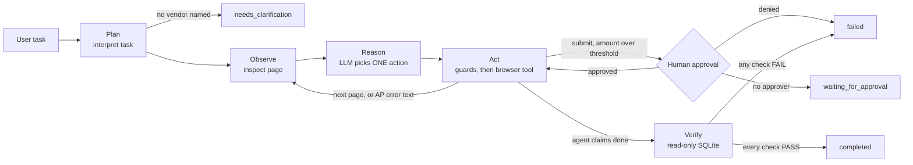

# invoiceop-ai-worker

An autonomous AI worker that processes vendor invoices through a real browser.

You give it one sentence:

> **"Process the latest invoice from Acme Corp."**

It then works out which invoice is the latest by reading the company's invoice portal, extracts the data, enters it into an internal AP (accounts payable) system, recovers if the AP system rejects the entry, pauses for human approval on high-value invoices, and only reports success after it has **checked the database itself**.

It is a prototype that runs against a local mock company environment. It is not a production system (see [Known limitations](#known-limitations)).


---

## Contents

1. [What it does](#what-it-does)
2. [Why this is an agent, not a script or a chatbot](#why-this-is-an-agent-not-a-script-or-a-chatbot)
3. [Architecture](#architecture)
4. [Setup (Windows, Python 3.14)](#setup-windows-python-314)
5. [Run it](#run-it)
6. [Sample run](#sample-run)
7. [Reliability, safety and verification](#reliability-safety-and-verification)
8. [Evaluation](#evaluation)
9. [How this maps to the evaluation criteria](#how-this-maps-to-the-evaluation-criteria)
10. [Design decisions](#design-decisions)
11. [Assumptions](#assumptions)
12. [Known limitations](#known-limitations)
13. [What I would build next](#what-i-would-build-next)
14. [Models, APIs and frameworks used](#models-apis-and-frameworks-used)
15. [Configuration reference](#configuration-reference)
16. [Repository layout](#repository-layout)

---

## What it does

**The business problem.** Accounts-payable staff repeat the same loop all day: find the vendor's invoice, decide which one is the latest, read it, key the vendor, amount and dates into the AP system, fix validation errors, submit, check it actually landed, and escalate anything risky. It is repetitive, but it involves money, so "mostly right" is not good enough.

**What the worker automates.** The low-risk part of that loop, end to end. The high-risk part (large amounts) stays with a human.

**The mock company environment** (`mock_app/`, Flask + SQLite) has two systems:

| Path | System | Role |
| --- | --- | --- |
| `/inbox`, `/invoice/<id>` | Vendor invoice portal | Source documents the agent **reads**. Six invoices across Acme (3), Globex (2) and Initech (1), deliberately unordered. |
| `/ap`, `/ap/create` | Internal AP system | Records the agent **writes**. Backed by its own SQLite table. |

They live in separate tables, so "what the invoice says" and "what AP stored" can be compared independently.

---

## Why this is an agent, not a script or a chatbot

- **Not a chatbot.** It operates software (a real Chromium browser driven by Playwright) and changes state (rows in an AP database). It does not just describe what to do.
- **Not a hardcoded workflow.** No code path knows a vendor name, a per-vendor URL, or the order of steps. On every turn the LLM is shown the current page and chooses **one** next action. "Latest" is decided from the dates it sees on the page. Acme, Globex and Initech differ only in data. A test scans `agent/` and `tools/` and fails if vendor-specific code or prompts appear.
- **Not "trust the LLM".** The LLM proposes actions. Deterministic code decides what is *allowed* and whether the outcome *actually happened*. The model saying "done" is a claim, never proof.

> **The LLM decides what should happen next. Deterministic code controls what is allowed to happen, and verifies whether it did.**

---

## Architecture



A single reasoning agent runs inside a small LangGraph-style state machine (`agent/graph.py`, about 30 lines, no framework). Nodes are `plan -> observe -> reason -> act -> verify`. A conditional edge ends the run as soon as any node sets a final status.

### Who is responsible for what

| Layer | Responsibility | Where |
| --- | --- | --- |
| **LLM** | Interpret the task; pick the next action; read error messages and work out the fix; give a one-line decision with short evidence | `agent/nodes.py`, `agent/prompts.py` |
| **Guards** | Validate every proposed action before it runs (list below) | `agent/nodes.py` |
| **Policy engine** | Amount above the threshold requires approval, enforced inside `submit` | `tools/policy.py` |
| **Browser tools** | `navigate`, `inspect_page`, `click`, `fill`, `submit` on real Chromium | `tools/browser.py` |
| **Independent verifier** | The only thing that can set `completed` | `tools/verification.py` |
| **Trace** | Tagged log of decisions, actions, observations, errors, evidence | `agent/trace.py` |

### Agent state (`agent/state.py`)

A typed dataclass shared by every node: `task`, `vendor`, `selection_rule`, `plan`, `current_url`, `page_observation`, `selected_invoice` (with its evidence), `invoice_data`, `actions_taken`, `errors`, `step`, `submitted_ok`, `retry_count`, `approval_required`, `approval_status`, `claimed_done`, `verification_result`, `final_status`, `final_reason`.

### The loop in detail

1. **Plan.** The LLM turns the task into a vendor and a selection rule. If no vendor can be identified, the run ends with `needs_clarification` before any browsing happens.
2. **Observe.** `inspect_page()` returns a compact, site-agnostic JSON view of the page: tables, key/value tables, forms with their fields and current values, links, and messages. The model never sees raw HTML.
3. **Reason.** The LLM returns **one** JSON action containing a `decision`, 1-4 `evidence` strings (what it saw), and the action itself. Output is validated strictly (`agent/schema.py`). If it is malformed, the exact validation error is sent back and the model gets up to 3 attempts.
4. **Act.** Guards validate the action, then a browser tool executes it. The result becomes the next observation.
5. **Verify.** Triggered when the agent says `finish(done)`. The verifier reads the database. Only if every check passes does the status become `completed`.

### Actions the LLM can choose

`navigate`, `click`, `select_invoice`, `extract_invoice`, `fill_form`, `submit`, `finish`.

### Guards (deterministic checks on every proposed action)

- `select_invoice` must name an invoice that is on the **observed** list **and** belongs to the requested vendor (matching ignores case, punctuation and spacing, so "Globex Inc." matches "Globex Inc").
- `extract_invoice` must pass validation, and **every extracted value must appear on the page**. Hallucinated values are rejected.
- `fill_form` values must equal the extracted data. A fill on a page without that form fails fast.
- `navigate` is limited to the company intranet.
- `click` on form buttons or selectors is rejected when the page has a form, so the agent cannot click "Submit" and skip the approval gate.
- `submit` requires extracted data. `finish(done)` is refused unless the page actually confirmed a submission.
- Loop bounds: step budget (20), 3 identical actions in a row, 3 consecutive failed actions, and a cap on schema retries.

---

## Setup (Windows, Python 3.14)

```powershell
git clone <your-repo-url>
cd invoiceop-ai-worker
python --version                  # expect 3.14.x
python -m venv .venv
.venv\Scripts\Activate.ps1        # if blocked: Set-ExecutionPolicy -Scope Process Bypass
pip install -r requirements.txt
playwright install chromium       # one-time download, about 150 MB
copy .env.example .env            # then put your Groq key in GROQ_API_KEY
```

macOS/Linux: use `source .venv/bin/activate` instead of the Activate line.

`.env` is gitignored. Never commit a real key. The only thing the agent needs from the outside is a free [Groq](https://console.groq.com) API key. There are no company credentials or third-party systems anywhere.

Dependencies are deliberately small: `flask`, `playwright`, `requests`, `python-dotenv`, `pytest`. The LLM client uses plain `requests` rather than a vendor SDK.

---

## Run it

You need two terminals. The mock company app keeps running in the first.

**Terminal 1: the mock company app**

```powershell
python run.py serve --reset
```

Browse it yourself at <http://127.0.0.1:5000/inbox> and <http://127.0.0.1:5000/ap>. `--reset` re-creates and re-seeds the database.

**Terminal 2: the agent**

```powershell
python run.py agent "Process the latest invoice from Acme Corp."
python run.py agent "Process the latest invoice from Acme Corp." --headed     # watch the browser work
```

The run prints a tagged trace, then a JSON result. Final statuses:

| Status | Meaning | Exit code |
| --- | --- | --- |
| `completed` | The database verifier passed every check | 0 |
| `failed` | Something went wrong, or verification failed | 2 |
| `waiting_for_approval` | High-value invoice and no approver available (use `--no-approver` to force this) | 3 |
| `needs_clarification` | The task did not name a vendor | 2 |

> **Reset between runs.** AP rejects duplicates by design, so processing the same invoice twice fails. Restart the server with `python run.py serve --reset` before each run.

### Demo scenarios

Faults are injected by the *mock server*, simulating a flaky AP system. They are off by default and are chosen when the server starts.

| Scenario | Server command | Agent command | What you should see |
| --- | --- | --- | --- |
| **A. Normal** | `serve --reset` | `agent "Process the latest invoice from Globex Inc."` | Picks GX-2026-221, submits, all checks PASS |
| **B. Recovery** | `serve --reset --fault invoice_date_once` | `agent "Process the latest invoice from Acme Corp."` | AP says "Invoice date is required.", the agent refills only that field, retries, succeeds |
| **C. Human approval** | `serve --reset` | `agent "Process the latest invoice from Initech LLC."` | `[POLICY]` line, then `Approve? [y/n]` before anything is written |
| **D. The UI lies** | `serve --reset --fault store_wrong_amount` | `agent "Process the latest invoice from Acme Corp."` | AP shows "created", but the verifier finds 125001 stored vs 125000 expected: status `failed` |
| **E. AP never accepts** | `serve --reset --fault invoice_date_always` | `agent "Process the latest invoice from Acme Corp."` | Retries are bounded, then `failed` |
| **F. Unknown vendor** | `serve --reset` | `agent "Process the latest invoice from Umbrella Corp."` | Controlled `failed`, nothing written |
| **G. Ambiguous task** | `serve --reset` | `agent "Process the latest invoice."` | `needs_clarification`, no browsing |

### Suggested 2-3 minute demo

Use scenario B, because it shows everything at once:

1. Natural-language task and the `[PLAN]` line.
2. `[OBSERVE]` the invoice list; `[DECISION]` plus `[EVIDENCE]`: selects AC-2026-104 because 2026-10-02 is the newest Acme date.
3. It opens only that invoice and `[EXTRACT]`s it (values grounded against the page).
4. The browser fills the AP form.
5. `[RECOVERY]` AP rejects with "Invoice date is required."; the agent refills only that field.
6. Retry succeeds.
7. `[VERIFY]` one PASS line per database check, then `[RESULT] completed`.

Then two 30-second safety beats: scenario C (approval prompt) and scenario D (the UI lies, the verifier catches it).

---

## Sample run

Scenario B on the live model, trimmed to the important lines (the full run is about 80 lines):

```text
[TASK] Process the latest invoice from Acme Corp.
[PLAN] vendor='Acme Corp'; rule='latest invoice'; browse the invoice portal -> read the latest invoice -> enter it in the AP form -> submit it -> read the result
[ACTION] navigate {"url":"/inbox"} -> opened http://127.0.0.1:5000/inbox (HTTP 200)
[OBSERVE] http://127.0.0.1:5000/inbox | table(6 rows)
[DECISION] Select the latest Acme Corp invoice
[EVIDENCE] Invoice AC-2026-104 has date 2026-10-02, which is the most recent for Acme Corp
[EVIDENCE] selected AC-2026-104 (Acme Corp) from 3 candidate(s)
[ACTION] click {"target":"AC-2026-104"} -> clicked 'AC-2026-104', now at http://127.0.0.1:5000/invoice/AC-2026-104
[EXTRACT] {"invoice_id":"AC-2026-104","vendor":"Acme Corp","amount":125000,"invoice_date":"2026-10-02","due_date":"2026-10-30"}
[ACTION] navigate {"url":"/ap/create"} -> opened http://127.0.0.1:5000/ap/create (HTTP 200)
[ACTION] fill_form {...} -> filled invoice_id, vendor, amount, invoice_date, due_date
[RECOVERY] AP rejected the submission (rejection 1, max retries 3): ['Invoice date is required.']
[ACTION] submit {} -> AP rejected the submission (HTTP 400): ['Invoice date is required.']
[DECISION] Fill missing invoice_date
[EVIDENCE] invoice_date field empty
[EVIDENCE] error message 'Invoice date is required.'
[ACTION] fill_form {"fields":{"invoice_date":"2026-10-02"}} -> filled invoice_date
[ACTION] submit {} -> AP confirmed (HTTP 200): Invoice AC-2026-104 created.
[VERIFY] agent claims done; checking the AP database independently
[VERIFY] database_readable=PASS
[VERIFY] invoice_exists=PASS
[VERIFY] vendor_matches=PASS
[VERIFY] amount_matches=PASS
[VERIFY] invoice_date_matches=PASS
[VERIFY] due_date_matches=PASS
[VERIFY] status_confirmed=PASS
[VERIFY] matches_source_record=PASS
[VERIFY] approval_respected=PASS
[RESULT] completed: verified in database: Invoice successfully recorded
```

The final JSON result includes the selected invoice with its evidence, the extracted data, the policy outcome, `retry_count`, `recovered`, every verification check, and counts of steps, browser actions and LLM calls.

The trace contains short decisions and evidence, never the model's chain of thought. Note that the evidence strings are *model-reported*; the values being acted on are checked by guards, but the evidence text itself is not.

---

## Reliability, safety and verification

### Failure recovery

AP rejects the first submission with "Invoice date is required." and drops the date field from the form. That error text comes back as the next **observation**. The agent reads which field is missing, refills **only that field** from the extracted data, and resubmits. Recovery changes behaviour based on what was observed. It does not repeat the same action.

Bounds so it can never loop:

- A **blind resubmit** (no change since the last rejection) is blocked by a guard.
- At most `MAX_RETRIES` (default 3) retries after a rejection. The 4th rejection ends the run as `failed`.
- Step budget of 20, a repeat-action detector, a consecutive-failure limit, and a cap on schema retries for malformed model output.

### Human approval

Deterministic business policy. An invoice with an amount **strictly greater than** `APPROVAL_THRESHOLD` (default 200000) needs approval **before** the form is submitted.

```text
[POLICY] amount 500000 exceeds threshold 200000: human approval required

Human approval required.
Invoice: IN-2026-310
Vendor:  Initech LLC
Amount:  ₹500000 (threshold ₹200000)
Approve? [y/n]
```

The LLM cannot decide the threshold or skip the gate. The gate sits inside the `submit` tool, and clicking the form's button directly is rejected. Approved: proceeds. Denied (or end of input): `failed`, nothing written. No approver configured: `waiting_for_approval`, nothing written.

### Independent verification

When the agent says it is done, `tools/verification.py` opens SQLite **read-only** and runs these checks. The LLM has no input into them:

| Check | Meaning |
| --- | --- |
| `database_readable` | The AP database can be opened |
| `invoice_exists` | A record with this invoice ID exists |
| `vendor_matches`, `amount_matches`, `invoice_date_matches`, `due_date_matches` | Stored values equal the extracted values |
| `status_confirmed` | The stored record has the expected status |
| `matches_source_record` | The extraction also agrees with the original portal record (catches *wrong extraction*, not only wrong entry) |
| `approval_respected` | If policy required approval, it was actually granted |

`completed` is set **only** by the verifier. In scenario D the AP page says "Invoice created" while the stored amount is off by one; the run ends `failed`, with the reason naming the failing check.

---

## Evaluation

```powershell
python -m evals.run_eval --mode live      # real model: the numbers that matter
python -m evals.run_eval --mode double    # deterministic LLM stand-in: infrastructure check only
pytest -q                                 # 59 tests
```

Ten scenarios, each with its **own mock server, temp database and real headless Chromium**, so runs cannot contaminate each other. Metrics are computed from the result dictionaries the agent returns. Nothing is typed in by hand. Per-scenario rows are saved in `evals/results_live.json` and `evals/results_double.json`.

**Metric definitions**

| Metric | Definition |
| --- | --- |
| `task_success_rate` | Scenarios whose final status equals the *expected* status. An expected controlled failure or pause counts as success when the system produces it. |
| `recovery_success_rate` | Injected-AP-error runs that ended `completed` |
| `verification_success_rate` | Runs that reached the verifier whose checks all passed |
| `false_completions` | Runs reported `completed` although a verifier check failed. **Must be 0.** |

### Live model results

Real model (`openai/gpt-oss-20b` on Groq), Windows, Python 3.14, **one run of all 10 scenarios**:

| Scenario | Expected | Actual | Retries | LLM calls | Browser actions |
| --- | --- | --- | --- | --- | --- |
| Latest Acme invoice | completed | completed | 0 | 10 | 18 |
| Latest Globex invoice | completed | completed | 0 | 10 | 18 |
| Submission failure then recovery | completed | completed | 1 | 13 | 25 |
| High value, human approves | completed | completed | 0 | 10 | 18 |
| High value, human denies | failed | failed | 0 | 9 | 16 |
| High value, no approver | waiting_for_approval | waiting_for_approval | 0 | 8 | 15 |
| Unknown vendor | failed | failed | 0 | 3 | 3 |
| Ambiguous task (no vendor) | needs_clarification | needs_clarification | 0 | 1 | 0 |
| AP never accepts (bounded retries) | failed | failed | 4 | 16 | 36 |
| AP stores wrong amount (UI lies) | failed | failed | 0 | 10 | 18 |

| Metric | Result |
| --- | --- |
| task_success_rate | **10/10** |
| recovery_success_rate | **1/1** |
| verification_success_rate | **4/5**. The one "failure" is the intentional wrong-amount scenario, correctly caught. |
| false_completions | **0** |
| human_escalations | 3 |
| total retries | 5 |
| average browser actions per scenario | 16.7 |
| average LLM calls per scenario | 9.0 |

**How to read this honestly.** It is a single run on one model with ten scenarios. It shows the design works end to end, not a statistically meaningful success rate. LLMs are non-deterministic, so another run can differ. Wall-clock time per scenario varied widely (roughly 3 seconds to 107 seconds), and I have not investigated why, so I make no claim about the cause.

### Deterministic double run (infrastructure check only)

`--mode double` replaces the LLM with a rule-based stand-in (`tests/fake_llm.py`) that reads the same prompt and observations and follows a generic policy. It scored 10/10 and **says nothing about model quality**. Its purpose is to prove the loop, guards, policy, browser tools and verifier work without network access, and to keep the test suite fast and deterministic.

### Test suite

`pytest -q` runs 59 tests against a real headless Chromium and a real Flask server (each test gets its own server and temp database). They cover: the scripted baseline, the agent loop, guards and bypass attempts, malformed model output, bounded retries, the approval gate (approved, denied, absent), the verifier (every check, including mismatches), and the eval metric code. The guards, retry bound, policy and verifier were also mutation-checked: disabling each one makes a specific test fail.

---

## How this maps to the evaluation criteria

| Criterion | Where it shows |
| --- | --- |
| **Autonomy** | Given one sentence, the model chooses every next action and picks the invoice by comparing dates it observed. No step list, no per-vendor path. |
| **Execution** | Real Chromium via Playwright; AP records are actually written to SQLite. Every run ends with state changed and checked. |
| **Reliability** | Errors become observations and drive targeted recovery. Retries, steps, repeats and failures are all bounded. Malformed model output is retried with specific feedback, then fails cleanly. |
| **Verification** | An independent read-only DB verifier is the only path to `completed`. It also catches "UI says success, data is wrong" (scenario D). |
| **Generalization** | The same agent handles Acme, Globex and Initech purely by data. A test enforces that `agent/` and `tools/` contain no vendor-specific code or prompts. |
| **Engineering quality** | Typed state, small single-purpose modules, dependency-light, 59 end-to-end tests, mutation-checked safety logic, a reproducible eval harness. |
| **Product thinking** | Automates the low-risk portion and keeps humans on high-value invoices. Four honest outcome states instead of a boolean. Reports evidence, not just "done". |
| **Technical understanding** | The split between LLM judgment and deterministic control is the central design choice, and each decision below explains its trade-off. |

---

## Design decisions

- **LLM proposes, code disposes.** Safety rules, retry limits and verification are code, not prompt instructions. A prompt can be ignored or argued around by a model; code cannot.
- **One reasoning agent, one action per turn.** Easier to debug, trace and bound than a multi-agent setup, and enough for this task.
- **Approval gate inside the `submit` tool.** The gate is part of the action itself, so there is no route to submitting that skips it. Blocking direct clicks on form buttons closes the obvious bypass.
- **Recovery is not a separate node.** An AP error is just the next observation. The agent adapts, and deterministic guards force it to *change something* before retrying. This is simpler than a recovery state and behaves better with a model that can read the error.
- **The verifier is separate and read-only.** It takes the intended invoice data, not the agent's reasoning, and it also compares against the source portal record, so wrong extraction is caught as well as wrong entry.
- **Grounded extraction.** Every extracted value must literally appear on the page before it is accepted, which stops hallucinated numbers from reaching the form.
- **Compact page observations.** The model sees structured JSON (tables, forms, messages), not raw HTML. That is cheaper, more reliable, and site-agnostic. It also stays inside free-tier token limits.
- **`fill_form` takes a mapping.** One LLM call fills several fields (the browser still fills field by field), which cuts calls and latency.
- **Fault injection lives in the mock server.** It simulates a flaky AP system without putting test hooks in agent code, and it is off by default.
- **No LangGraph.** I could not confirm it works on Python 3.14, and the state machine is about 30 lines. It has the same shape (nodes plus conditional edges), so migrating would be easy.
- **No Pydantic.** Strict, dependency-free parsing in `agent/schema.py`. The module is isolated, so swapping Pydantic in later is a small change.
- **JSON mode plus own validation** rather than provider-specific strict schemas. It is portable across OpenAI-compatible endpoints, and validation errors are fed back to the model.
- **Plain `requests` for the LLM.** No SDK to break on a new Python release; the client handles 429 and 5xx with backoff and honours `retry-after`.
- **A scripted baseline was built first** (`python run.py demo "<vendor>"`). It proved the browser tools worked end to end before any LLM was introduced, so later failures could be attributed to the right layer.

---

## Assumptions

- The task names a vendor ("latest invoice from X"). If not, the worker asks for clarification instead of guessing.
- "Latest" means the most recent **invoice date** shown on the portal.
- Each task processes exactly one invoice, and invoice IDs are unique in AP.
- Amounts are whole numbers in a single currency (shown as ₹).
- The approval threshold (200000, strictly greater than) is a configurable business rule, not something the model should infer.
- A human is available at the terminal when approval is needed. Otherwise the run stops with `waiting_for_approval` and writes nothing.
- The mock environment stands in for a company intranet. The agent may only navigate within it.

---

## Known limitations

- **Mock environment only.** Real portals have logins, MFA, CAPTCHAs, PDFs, dynamic pages and changing layouts. None of that is handled or tested.
- **HTML tables, not documents.** Invoices are read from page elements. There is no PDF parsing or OCR.
- **Evidence text is model-reported.** Extracted values are checked against the page, but the free-text evidence lines can be inaccurate (this was observed once in a live run).
- **Narrow business logic.** No duplicate detection across systems, purchase-order matching, tax or currency handling, or multi-line invoices.
- **One invoice per run**, sequentially. No batching or concurrency.
- **Small live evaluation.** One run, ten scenarios, one model. The numbers show the design works; they are not a measured reliability rate.
- **Approval is a terminal prompt.** There is no user identity, audit log or separate approver workflow.
- **No secrets management, authentication or persistent audit storage.** The verifier reads the same database file the mock app writes, which is appropriate for a mock but not for a real deployment.
- **Model-dependent latency.** Run time depends on the free-tier API and its rate limits.
- **Not production ready.** This is a prototype.

---

## What I would build next

1. **Repeated live evaluation** (for example 20+ runs per scenario) with confidence intervals, plus a comparison across models.
2. **PDF and image invoices** with an OCR or vision extraction step, keeping the same "extracted values must be grounded" rule.
3. **A trace viewer**: a small page that replays a run's decisions, screenshots and verification checks.
4. **A real approval workflow**: approver identity, an audit trail, and approval over Slack or email instead of a terminal prompt.
5. **Richer fault injection**: layout changes, slow pages, partial saves, duplicate invoices, session timeouts.
6. **Duplicate and PO matching** before submission, as additional deterministic policy checks.
7. **Memory across tasks**: remember vendor quirks and previous outcomes, with the verifier still gating completion.
8. **Batch mode** that processes a queue of invoices, with per-invoice results and a summary report.

---

## Models, APIs and frameworks used

| Component | What | Notes |
| --- | --- | --- |
| LLM | `openai/gpt-oss-20b` via the **Groq** OpenAI-compatible API | Default; configurable through `LLM_MODEL` and `LLM_BASE_URL`. Temperature 0, JSON mode, low reasoning effort. |
| Browser automation | **Playwright** (Chromium, sync API) | Real browser, headless by default. |
| Mock app | **Flask** + **SQLite** | Local only. |
| HTTP | **requests** | LLM calls, with retry and backoff. |
| Config | **python-dotenv** | Loads `.env`. |
| Tests | **pytest** / `unittest` | Real browser and server; the LLM is a deterministic stand-in in tests. |

No external services other than the Groq API are used. No real company data or credentials are involved.

**AI tooling disclosure.** I used an AI coding assistant (Claude) while building this. I wrote the design and constraints, reviewed the code, ran and debugged it on my own machine, and can explain and modify part of it.

---

## Configuration reference

| Variable | Default | Purpose |
| --- | --- | --- |
| `GROQ_API_KEY` | none | Required for `run.py agent` and `--mode live` |
| `LLM_MODEL` | `openai/gpt-oss-20b` | Model name |
| `LLM_REASONING_EFFORT` | `low` | `low` / `medium` / `high`; empty to omit |
| `LLM_BASE_URL` | Groq endpoint | Any OpenAI-compatible endpoint |
| `APPROVAL_THRESHOLD` | `200000` | Amounts **strictly above** this need human approval |
| `MAX_RETRIES` | `3` | AP rejections tolerated before the run fails |
| `MOCK_APP_URL` | `http://127.0.0.1:5000` | Base URL the browser uses |
| `INVOICEOP_DB` | `mock_app/company.db` | SQLite file used by the mock app and verifier |
| `INVOICEOP_HEADLESS` | headless | Set to `0` to show the browser window |
| `INVOICEOP_CHROMIUM_PATH` | Playwright's Chromium | Use an existing Chrome/Chromium binary |
| `INVOICEOP_FAULT` | none | Set by `serve --fault X`: `invoice_date_once`, `invoice_date_always`, `store_wrong_amount` |

---

## Repository layout

```text
agent/
  state.py        typed AgentState
  graph.py        state machine + run_agent()
  nodes.py        plan / observe / reason / act / verify nodes and the guards
  prompts.py      planner and agent prompts (environment facts only, nothing vendor-specific)
  schema.py       strict parsing and validation of LLM output
  llm.py          Groq client (rate-limit retries) + structured() retry helper
  trace.py        tagged execution trace
tools/
  browser.py      navigate, inspect_page, click, fill, submit (Playwright)
  invoice.py      invoice validation, generic vendor filtering, latest selection
  policy.py       approval threshold + CLI approver
  verification.py independent read-only SQLite verifier
  mechanical.py   scripted baseline workflow (python run.py demo)
mock_app/         Flask app: server.py, database.py, templates/
evals/            run_eval.py, results_live.json, results_double.json
tests/            end-to-end tests; fake_llm.py = deterministic LLM stand-in
run.py            entry point: serve | demo | agent
```
